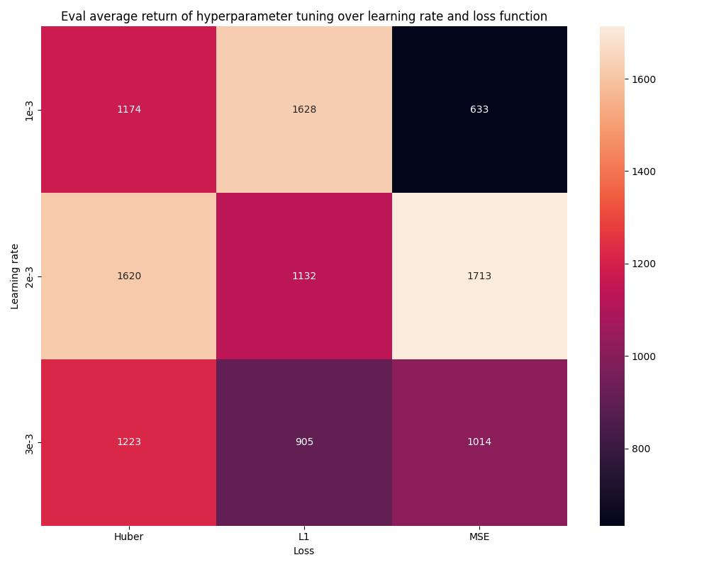
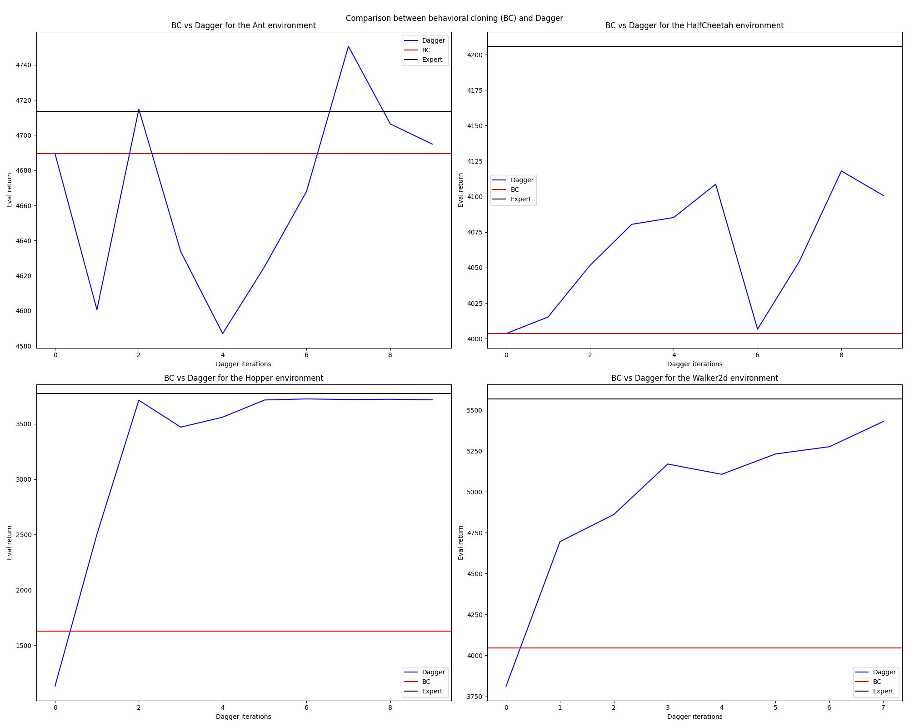

# Homework 1 Report

### Question 1.2
Every run uses an eval batch size of 100000 (averaging over at least 100 rollouts).

|Common parameters|Value|
|-----------------|-----|
|n_layers         |2    |
|size             |64   |
|train_batch_size |100  |

|Environment|Expert  |Average return|Std return|Learning rate|Loss   |Train steps|
|-----------|--------|--------------|----------|-------------|-------|-----------|
|Ant        |4713.653|4689.482      |421.529   |5e-3         |MSELoss|1000       |
|HalfCheetah|4205.778|4003.580      |106.259   |5e-3         |MSELoss|1000       |
|Hopper     |3772.670|1627.715      |324.464   |1e-3         |L1Loss |10000      |
|Walker2d   |5566.846|4045.609      |1616.452  |3e-3         |L1Loss |10000      |

### Question 1.3
We pick the Hopper environment where the expert has returns of 3772.670.

We pick our hyperparameter of interest to be our loss function, specifically over the MSE (default), L1, and Huber losses. Originally I wanted to understand how the loss landscape affects the performance of our bc agent because the loss itself was always very small i.e. less than 0.001. I originally wanted to use more accurate loss functions in the sense that a loss value of 0.001 is already really small which typically indicates that a model is performing well on the task. However, I noticed that loss doesn't necessarily correlate with model performance i.e. similar losses produced by different hyperparameters had different eval returns.

We further tune each loss function over three learning rates {1e-5, 2e-5, 3e-5}.

Every run uses an eval batch size of 100000 (averaging over at least 100 rollouts).

|Common parameters|Value|
|-----------------|-----|
|n_layers         |2    |
|size             |64   |
|train_batch_size |100  |
|train_steps      |10000|

|Loss |Learning rate|Average return|Std return|
|-----|-------------|--------------|----------|
|Huber|1e-5         |1173.878      |272.612   |
|Huber|2e-5         |1619.547      |838.942   |
|Huber|3e-5         |1222.753      |520.960   |
|L1   |1e-5         |1627.714      |324.463   |
|L1   |2e-5         |1131.511      |141.434   |
|L1   |3e-5         |904.527       |547.761   |
|MSE  |1e-5         |632.625       |276.141   |
|MSE  |2e-5         |1712.986      |502.882   |
|MSE  |3e-5         |1013.853      |463.724   |

### Question 2.2
All envs use an `n_iter` value of 10.

The other hyperparameters are the same as in Question 1.2. Please reference the table there.

