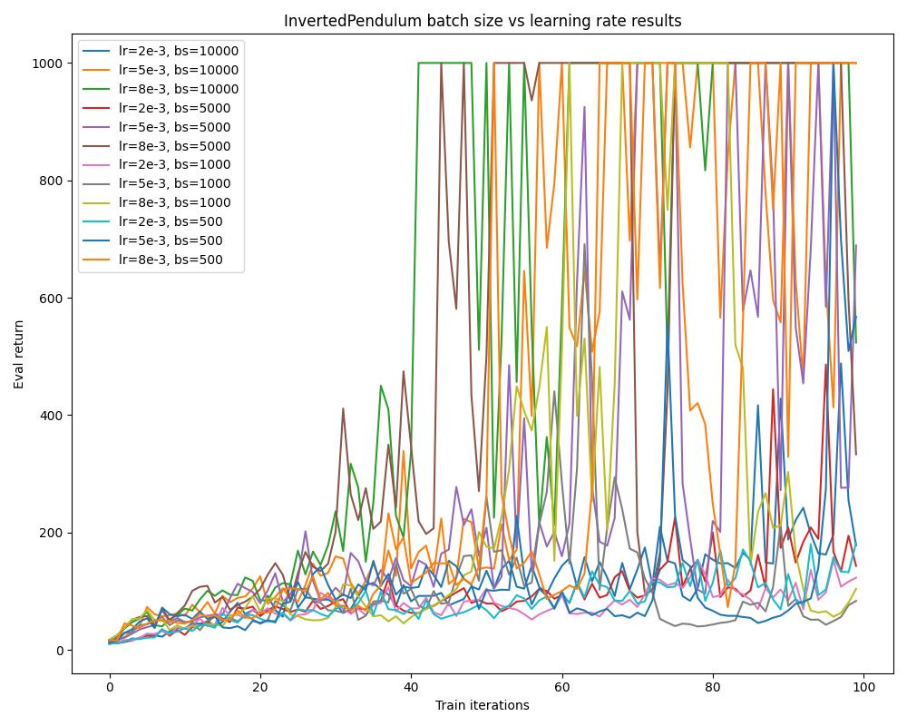

### Exercise 5.1
The parameters used were the exact same parameters as the default provided in the instructions.
For run replication, see `scripts/run_5_1.sh`.

1. Which value estimator has better performance without advantage-standardization: the trajectory centric one, or the one using reward-to-go?

The reward to go value estimator had better performance than the trajectory centric value estimator. For the small batch size case, neither configuration converged to the optimal 200 reward value, but the trajectory centric value estimator had much lower mins and more frequent dips in performance. For the large batch case, the reward to go estimator converged while the trajectory centric one didn't.

2. Did advantage standardization help?

Advantage standardization helped a lot in the small batch case but not as much in the large batch case. For the small batch case, the reward to go value estimator without advantage standardization didn't converge while the reward to go value estimator with advantage standardization did. For the large batch case, the reward to go value estimators for both the without and with advantage standardization cases converged, but the config with advantage standardization had fewer dips in performance and when it did dip, it dipped less than the config without advantage standardization.

3. Did the batch size make an impact?

Batch size did make an impact, specifically in the case where we use the reward to go value estimator without advantage standardization. The estimator didn't converge in the small batch case but it did converge in the large batch case.

### Exercise 5.2
For run replication, see `scripts/run_5_1.sh`.

