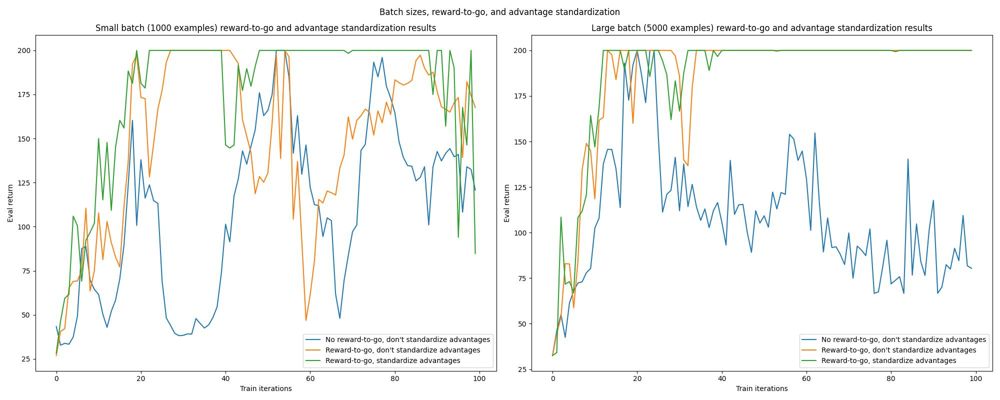

### Exercise 5.1
The parameters used were the exact same parameters as the default provided in the instructions.
```bash
# No reward-to-go, don't standardize advantages, batch size=1000
python cs285/scripts/run_hw2.py \
    --exp_name q1_sb_no_rtg_dsa \
    --env_name CartPole-v0 \
    -n 100 \
    -b 1000 \
    -dsa

# Reward-to-go, don't standardize advantages, batch size=1000
python cs285/scripts/run_hw2.py \
    --exp_name q1_sb_rtg_dsa \
    --env_name CartPole-v0 \
    -n 100 \
    -b 1000 \
    -rtg \
    -dsa

# Reward-to-go, standardize advantages, batch size=1000
python cs285/scripts/run_hw2.py \
    --exp_name q1_sb_rtg_na \
    --env_name CartPole-v0 \
    -n 100 \
    -b 1000 \
    -rtg \

# No reward-to-go, don't standardize advantages, batch size=5000
python cs285/scripts/run_hw2.py \
    --exp_name q1_lb_no_rtg_dsa \
    --env_name CartPole-v0 \
    -n 100 \
    -b 5000 \
    -dsa \

# Reward-to-go, don't standardize advantages, batch size=5000
python cs285/scripts/run_hw2.py \
    --exp_name q1_lb_rtg_dsa \
    --env_name CartPole-v0 \
    -n 100 \
    -b 5000 \
    -rtg \
    -dsa

# Reward-to-go, standardize advantages, batch size=5000
python cs285/scripts/run_hw2.py \
    --exp_name q1_lb_rtg_na \
    --env_name CartPole-v0 \
    -n 100 \
    -b 5000 \
    -rtg

```





1. Which value estimator has better performance without advantage-standardization: the trajectory centric one, or the one using reward-to-go?


2. Did advantage standardization help?


3. Did the batch size make an impact?


<div style="page-break-after: always;"></div>


### Exercise 5.2

