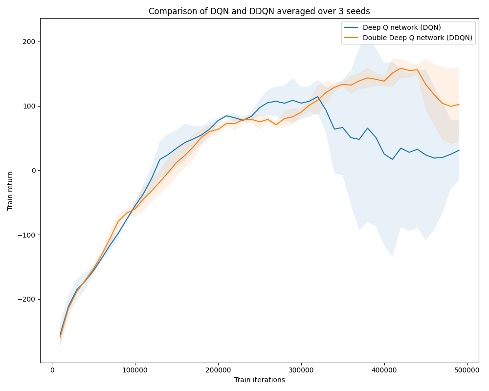
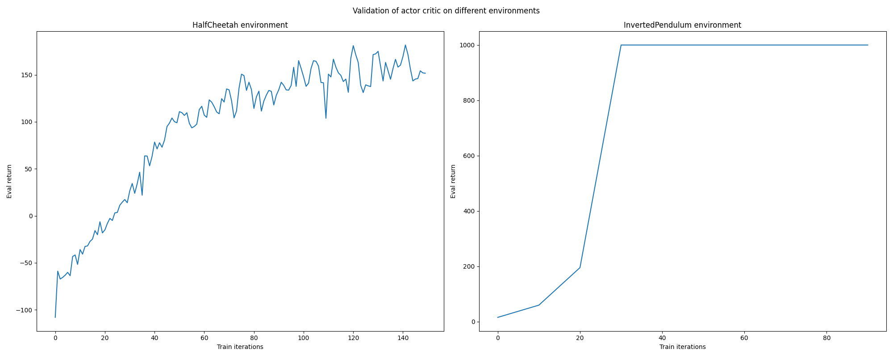

### Q1

See `scripts/run_q1.sh`

This implementation of Deep Q network on the MsPacman environment reaches the target 1500 return within 1e6 iterations. An interesting pattern is that typically the return will jump up as the agent learns something new about the environment and then the agent takes a few steps to explore in that area. This pattern repeats about a dozen times over the course of this training curve.

### Q2

See `scripts/run_q2.sh`

The DDQN has significantly lower variance compared to the DQN. In addition, the DQN performance drops off after ~350k iterations while the DDQN performance is better than DQN and doesn't start decreasing until later. Not sure if this is because DDQN won't regress as much or just because DDQN took more time to do even better than DQN. 

### Q3

See `scripts/run_q3.sh`

We compare the effect of adding learning rate schedule of linear warmup for the first 10% of steps and a linear decay afterwards and the effect of using the AdamW optimizer with weight decay = 1e-2 with the baseline Adam optimizer with no weight decay. 

Clearly, the case with AdamW and LR scheduling has the lowest variance and its performance doesn't regress at all. Both the cases for just AdamW or just LR scheduling do better than the baseline, but still have significant variance and regression as time progresses. 

### Q4

See `scripts/run_q4.sh`

The best configuration was 10 target updates and 10 grad steps per target update. It does make sense to a degree that we would want to update the target multiple times per update (compared to just 1), and it also makes sense to take 10 grad steps per target update (again, compared to just 1). The performance of the config with 1 target update and 100 grad steps per target update is the second best performing, but probably doesn't do as well as the 10/10 config because there's just less noise and progress in each update step since the target is constant for that entire step. 

### Q5

See `scripts/run_q5.sh`

The actor-critic agent reaches the target performances of 150 on HalfCheetah and 1000 on InvertedPendulum.

### Q6

See `scripts/run_q6.sh`

The soft actor-critic agent reaches the target performances of 300 on HalfCheetah and 1000 on InvertedPendulum.

