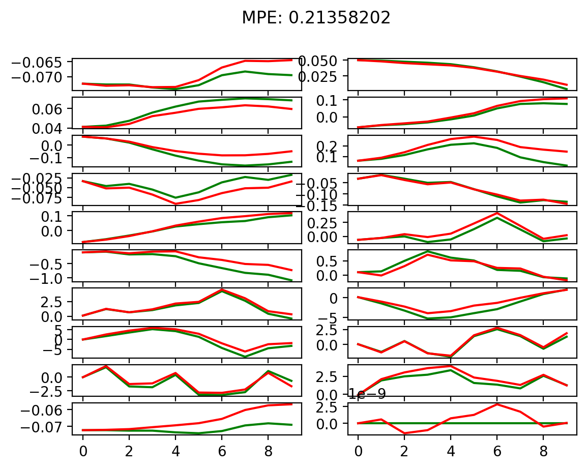
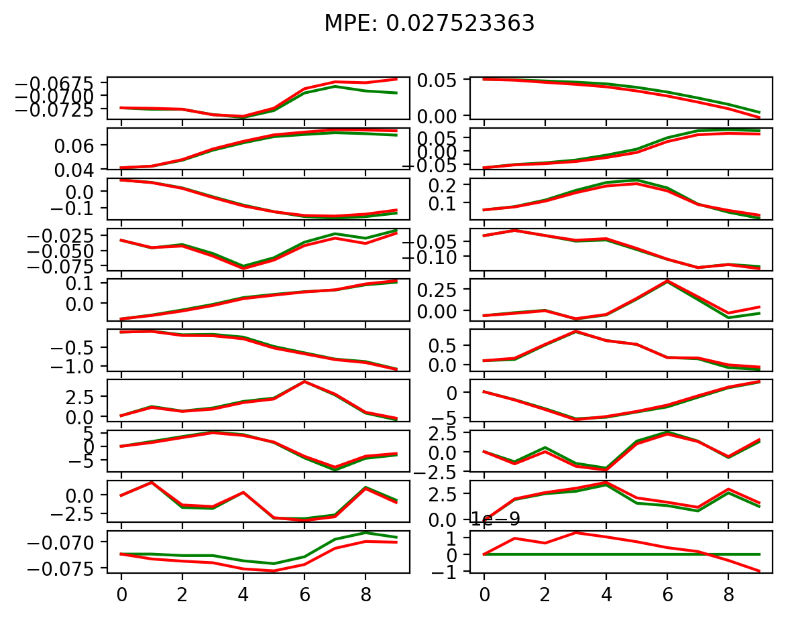
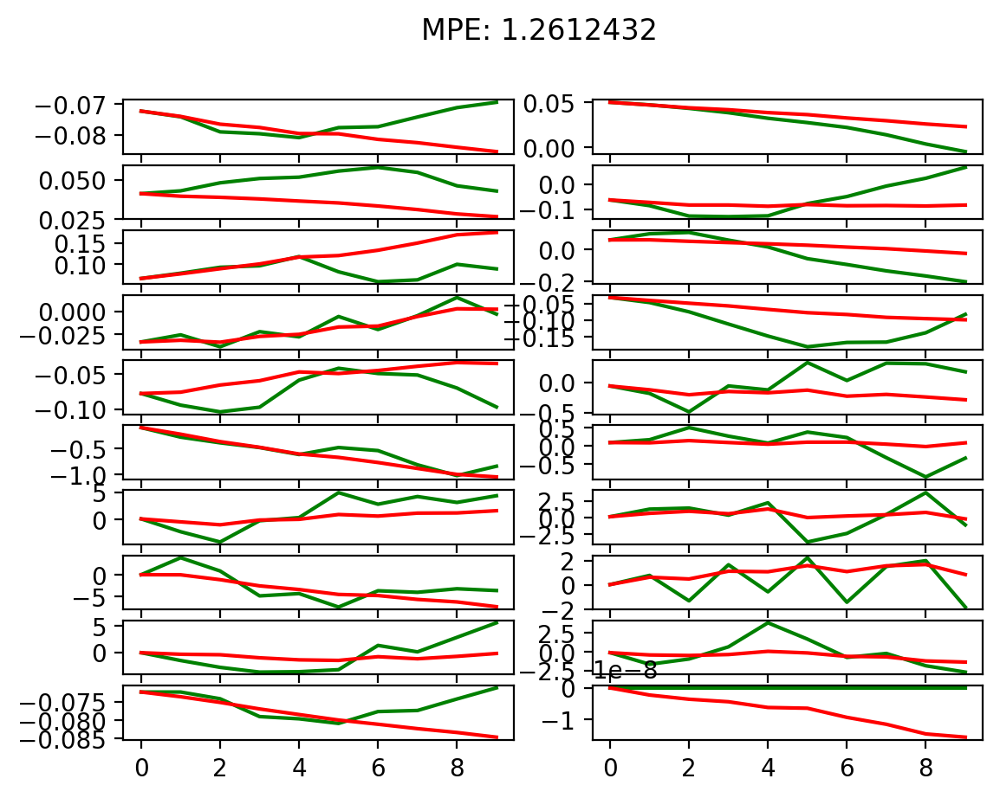
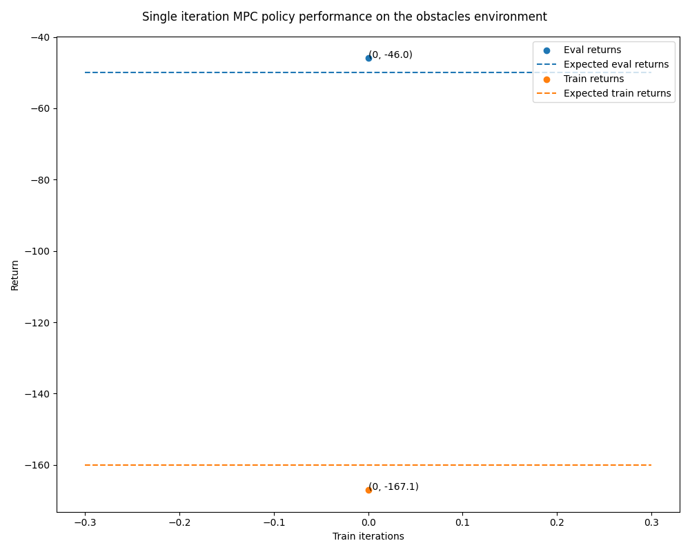
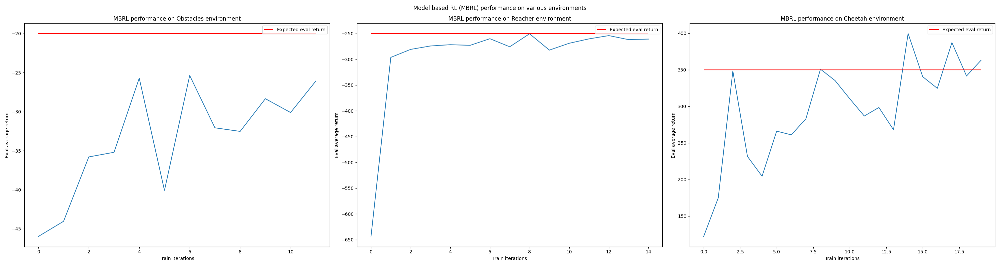
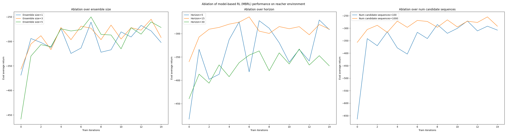
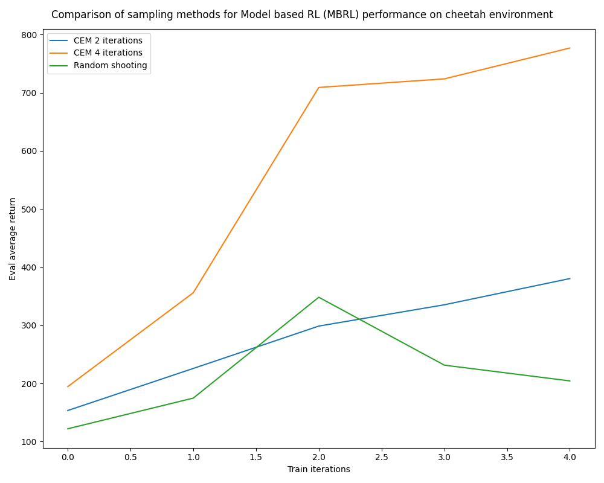
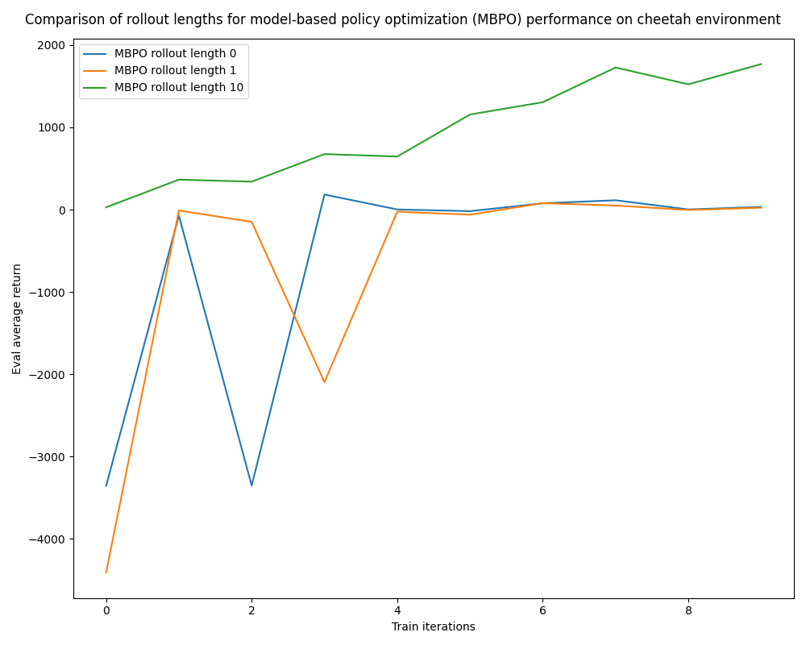

# Problem 1

    
    
    

The predictions results for a small model (1 layer of size 32) trained for 500 iterations (left), a large model (2 layers of size 250) trained for 500 iterations (center), and a large model (2 layers of size 250) trained for 5 iterations (right).

Clearly the large model trained for 500 iterations performs the best with the lowest mean prediction error (MPE) value of 0.028, outclassing the small model trained for the same amount of time. However, the large model definitely needs many iterations of training as the same size model trained for 5 iterations performed much much worse than either of the two other configurations.

This environment may be too complex for smaller models to correctly learn and also too complex for larger models to fully understand without sufficient datapoints.

# Problem 2

    

# Problem 3

    

# Problem 4

    

All three of the ablated ensemble size values reached around the same eval average return. Ensemble size of 3 was most consistent in doing so. Ensemble size of 5 had the lowest initial performance, probably because averages of initial estimates by more networks is more variable in the beginning.

The ablation with horizon length of 5 was wildly variable, jumping up and down. This means that horizon length 5 is too short. The ablation with horizon length of 30 had much lower performance than both of the other configs, signaling that horizon length of 30 is too long. This is probably due to distributional drift, where the model error compounds to a point past a certain horizon length where it's no longer useful. The best horizon length was 15, the middle ground in between the 2. The optimal horizon length probably depends on the maximum number of steps for a particular env and on how frequently we receive rewards.

The ablations of number of generated candidate action sequences tells us that the more candidate sequences we generate, the better our estimation of the true "optimal" action as the config with 1000 candidate action sequences was less variable and better performing than the config with 100 candidate action sequences.

# Problem 5

    

Cross-entropy sampling method (CEM) is much more consistent than random shooting, both in absolute average return as well as in improvement.

CEM with 4 iterations is much better than CEM with 2 iterations, where the former makes huge performance increases over single iterations and ends at almost double the score of the latter. This is probably because we iteratively maximize over elites. More iterations of maximization reduce variance and improve estimates when we sample from our normal distribution with elite mean and variance.

# Problem 6

    

MBPO with rollout lengths of 0 and 1 make progress to move to non-negative reward, but are unable to move past around 0 eval return i.e. they reach 0 return and then oscillate around 0. This is probably because the rollout lookahead length is too short to actually be informative to the policy for this particular environment. The performance of the config with rollout of length 10 steadily increases over iterations up to an impressive performance around 2000 eval average return. MBPO with rollouts of length 10 is able to make significant progress over much fewer policy training iterations than model-free and Dyna-style policy optimization.
