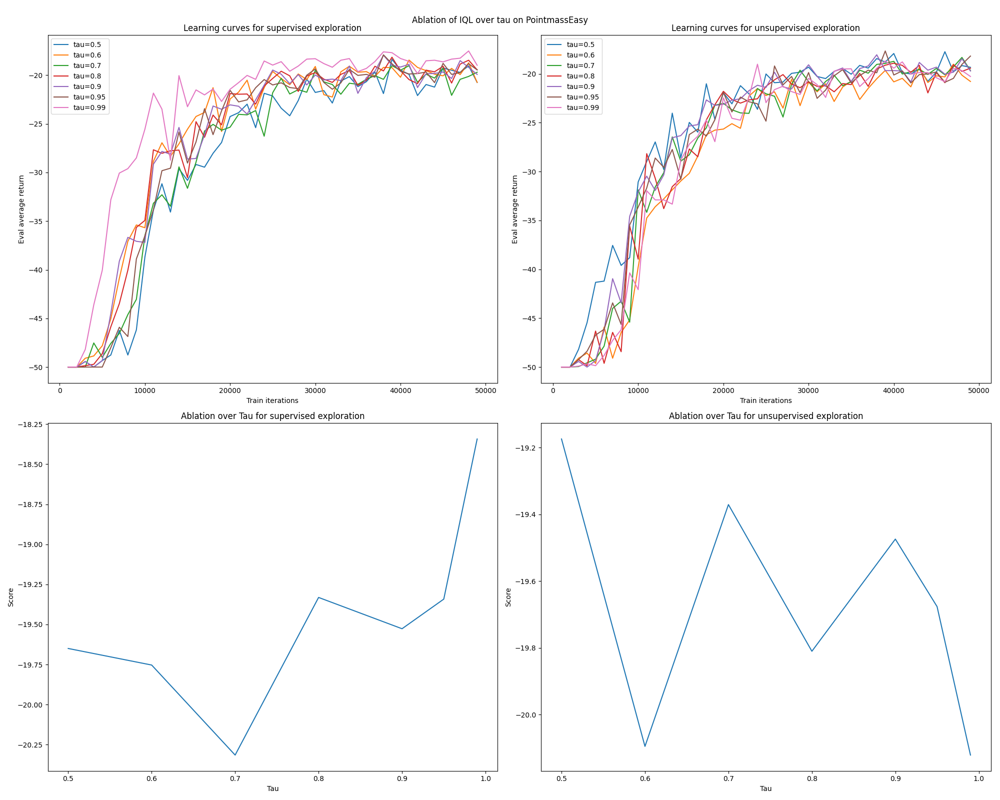

# Q1.1 RND vs Epsilon-greedy exploration

    
    

The state densities for epsilon-greedy and RND for the easy environment are roughly the same. Both are able to explore the easy environment proficiently. The learning curve for RND learns and converges much earlier and faster than that of epsilon-greedy, signaling that even in the easy environment RND poses an advantage over epsilon-greedy. RND also converges to the optimal solution before exploration has even finished, signaling that it did a very good job of exploring towards the end goal. Contrast this with epsilon-greedy, where the return only starts improving until around 5000 steps after exploration has finished. 

The state density structures for the medium environment are about the same, but the confidence of the correct path is different, as shown by the different in brightness between the two state density graphs. RND has more confidence in the states it has explored towards the goal than epsilon-greedy. 

This is also reflected in the fact that RND is much more stable than epsilon-greedy -- epsilon-greedy has two major regions of oscillation and non-monotonicity while RND has no such regions.

# Q1.2 RND vs RND L1 exploration

    

We modify the RND algorithm slightly. Instead of penalizing model prediction error by the square of the difference, we only penalize with the absolute value of the difference. The overall penalty is less.

This means that the model remembers less about past states visited, so it will bounce around states more often, especially around corners, as shown in the state density plot. This is also exactly what is observed in the last exploration trajectories.

This is a disadvantage earlier in each trajectory, where we observe the model getting stuck in corners. This is an advantage when the environment required to learn is more complex. Thus, the L1 and L2 penalty version of RND represent tradeoffs for modeling capacity and exploitation, respectively. 

This is further demonstrated on the PointmassHard environment, where the L1 RND does an incredibly proficient job at optimizing the trajectory, shown below. 

State densities and last exploration trajectory for PointmassHard environment with RND L1

    
    

# Q2.1 DQN vs CQL for offline learning on exploration data

    

CQL regularizes the magnitudes of the q-values predicted by DQN, bringing them closer to 0. In this case, it doesn't do much. The regularization is productive in this case to make the q-values positive.

Shifting the rewards by 1 in this case clearly helps with conditioning on the q-values as the q-values are slightly negative. This way, the q-values would be sent in a positive direction for more productive learning.

Scaling the rewards by 100 in this case would clearly help as well to make learning tractable. In fact, better conditioning on the rewards by shifting and scaling actually produces incredibly good results for DQN alone. This signals that maybe CQL acts as a conditioner for the DQN q-values.

# Q2.2 Ablation of DQN and CQL over number of exploration steps

    

CQL is much more consistent than either DQN or DQN with scaling and shifting. It seems that too much exploration is not a good thing, as the q-values get more and more inaccurate over time. This is probably due to saturation of our exploration neural network, where the regularization bias introduced by CQL actually does an effective job at preventing overfitting on our random network. Very cool!

# Q2.3 Ablation of CQL over alpha

    

Lower values of alpha introduce less regularization and higher values of alpha introduce more regularization. The results here are somewhat counterintuitive, one would expect that higher values of alpha drive predicted q-values closer to 0, but that is not the case. 

The best value of alpha is 0.1.

# Q3 Comparison of CQN and DQN on supervised exploration

    
    

The scaled and shifted versions of these two algorithms did better on supervised exploration. This is because the supervision uses a combination of mixed rewards, so having rewards on similar scales actually allows comparison and usage of both. 

The supervised version of DQN and CQL outperformed their unsupervised counterparts, both in stability of improvement and in performance. This is probably because the mixture of rewards acts as a prior on which states would be more efficient to continue exploring in. 

# Q4 Ablation of AWAC over lambda

    
    

The best value of lambda is 1.0. As lambda decreases, there's more variance in the runs but also more modeling capacity. As lambda increases, there's more stability but less learning.

# Q5 Ablation of IQL over tau

    
    

$$
\begin{align*}
\mathcal{L}_{V}(\phi) &= \mathbb{E}_{(s, a) ~ D} \left[ L_2^\tau(Q_\theta(s, a) - V_\phi(s) \right] \\
L_2^\tau(\mu) &= |\tau - \mathbb{1}\{\mu \leq 0\}|\mu^2
\end{align*}
$$

For the q-values of actions that **are not** better than the current value estimation of a state i.e. $Q_\theta(s, a) < V_\phi(s)$, as $\tau$ increases the penalty decreases. 

For the q-values of actions that **are** better than the current value estimation of a state i.e. $Q_\theta(s, a) >= V_\phi(s)$, as $\tau$ increases the penalty increases. 

Thus, $\tau$ controls how much the exploration model pays attention to q-values that are better or worse than expected. Typically, higher values of $\tau$ such as 0.9+ are better, signaling that it's more important that a model pays a lot of attention to q-values that are better than expected and pay less attention to q-values that are worse than expected.

