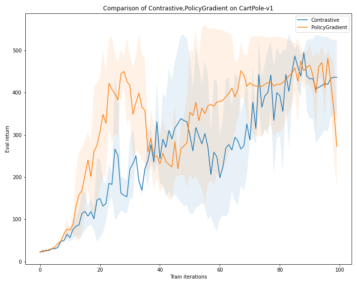
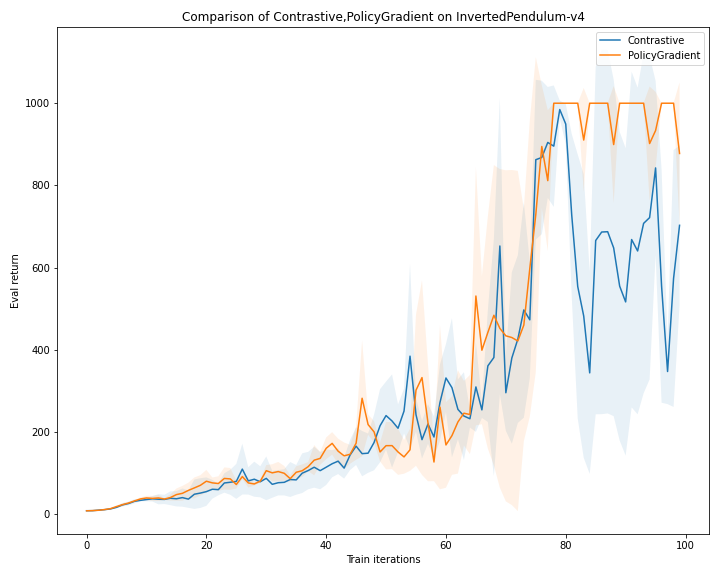

# Contrastive off-policy learning

## Algorithms
We compare two algorithms: a baseline vanilla policy gradient algorithm and a contrastive Q-values algorithm. Later on, more algorithms will be run and compared against.

### Policy gradient
Q-values are calculated using the reward-to-go or discounted cumsum formulation: $Q_t = r_t + \gamma * Q_{t+1}$ where $r_t$ is the reward collected at timestep $t$ and $\gamma$ is the discount.

The advantages are calculated using a neural network baseline $A_t = Q_t - V_t$ where $A_t$ is the advantage and $V_t$ is the predicted baseline value at time step $t$.

The policy incurs a loss proportional to the predicted log-probabilities of the selected actions according to a neural network policy $J_{\pi} = \sum_{i=1}^{L}\log \pi_i A_i$. 

The baseline incurs a Huber loss between the predicted values and subsequent Q-values $J_{\phi} = \sum_{i=1}^{L} \mathcal{L}(V_i, Q_i)$.

### Contrastive Q-values
The Q-values are calculated as in the policy gradient algorithm. The best Q-value over train steps for a particular timestep is stored.

The advantages are calculated between the best seen Q-value at that timestep and the current Q-value at that timestep $A_t = Q_t - Q^*_t$.

The policy incurs the same loss as in the policy gradient algorithm.

## Experimental setup

For each environment, all algorithms are given a compute budget of 100 train steps of `max_episode_length` steps and are evaluated every train step for 2 * `max_episode_length` steps.

|Environment        |Max episode length|Compute budget (env steps)|
|-------------------|------------------|--------------------------|
|        CartPole-v1|               500|                     50000|
|InvertedPendulum-v4|              1000|                    100000|

All experiments are performed on the same learning rate of `5e-3`. Later on, ablation studies will be performed over different learning rates. We use 3 different seeds for each algorithm experiment and average results over seeds.

All algorithms calculating Q-values use a discount value of $\gamma = 0.99$.

All the experiment code can be found [here](https://github.com/bri25yu/homework_fall2022/tree/main/rl)

## Results

## Preliminary analysis
The contrastive Q-values algorithm certainly learns, but it doesn't match the performance of the corresponding policy gradient algorithm. Specifically, the algorithm is very unstable, a sign of high variance. Perhaps using a variance-reduction tool such as the baseline in policy gradient would help.
